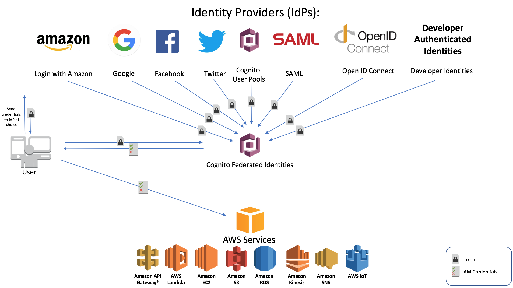
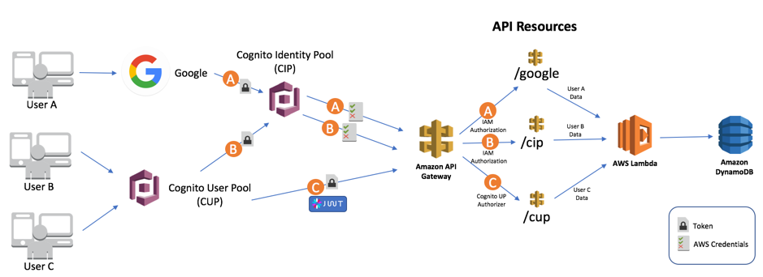

# Identity and Access Management

Topics
- [IAM](#iam)
- [Policy Evaluation](#policy-evaluation)
- [Cross-account access to S3 bucket and objects](#cross-account-access-to-s3-bucket-and-objects)
- [Cross-account access to Lambda](#cross-account-access-to-lambda)
- [Identity Federation](#identity-federation)
- [Cognito](#cognito)
- [STS](#sts)

---

## IAM
- IAM Users can be used to login to the AWS Console and can contain long-term AWS Credentials.
- IAM Roles provide short-term credentials and can be used with the AWS CLI via profiles.
- IAM Roles CANNOT be used to login to the AWS Console.
- IAM User is best used for a "service account" running one or more application processes in AWS. The application needs
  long-term credentials.
- **Permissions boundaries** allow control over WHAT an IAM user with delegated permissions can do.
- IAM users can be restricted via **resource AND identity policies**.
- ROOT users can be restricted using **service control policies** as long as accounts are inside an
  **AWS organisation**.

### IAM Policies
1. **Identity policies** (users, groups, roles) allow those identities to be ALLOWED or DENIED access to resources. 
2. **Resource policies** control who has access to that specific resource from its perspective (specify 
   "**Principal**"). E.g. S3 Bucket Policy.
3. **Roles**
   ```
   App --- (sts:AssumeRole)   --> Role
   App <-- (Temp credentials) <-- Role
   ```

### Policy Evaluation
- `Explicit Deny -> Explicit Allow -> Implicit Deny`
- DENY always wins against ALLOW. Policy evaluation looks at all user/group permissions.
- Boundaries are always processed first, starting with Organizational, then identity (User or Role).
- Then AWS checks if you have chosen a subset of permissions for a `sts:AssumeRole`.
- Final effective permissions are a merge of identity, resource, and ACL.
1. From
   1. Organizations Boundaries
   2. User or Role Boundaries
   3. Role Policies
   4. Permissions
2. From 
   1. Identity Policies
   2. Permissions
3. From
   1. Resource Policies
   2. Permissions

---

## Cross-account access to S3 bucket and objects

There are [3 ways](https://aws.amazon.com/premiumsupport/knowledge-center/cross-account-access-s3/) to
provide access to a S3 bucket (Account A) from another AWS account (Account B).

1. Bucket Policy and IAM Policy
   - For programmatic-only access to S3.
   - Account B users are the owner of any objects created. 
     Bucket policies can require Account A be the owner for objects as they are put in the bucket.
   - Bucket Policy at account A
     ```
        "Effect": "Allow",
        "Principal": {"AWS": "arn:aws:iam::AccountB:user/AccountBUserName"},
        "Action": ["s3:GetObject", "s3:PutObject", "s3:PutObjectAcl"],
        "Resource": "arn:aws:s3:::AccountABucketName/*"
     ```
   - IAM role or user in Account B with IAM policy
     ```
        "Effect": "Allow",
        "Action": ["s3:GetObject", "s3:PutObject", "s3:PutObjectAcl"],
        "Resource": "arn:aws:s3:::AccountABucketName/*"
     ```
2. ACL and IAM Policy
   - For programmatic-only access to S3.
   - Account A: Bucket ACL WRITE permission for Account B to upload objects.
   - Account B: IAM role or user with IAM policy (the same as (1) above).
   - Objects are owned by the identity who PUTs them.
   - ACLs can apply to objects.
3. Cross-account IAM Role
   - For programmatic and console access to S3.
   - Permissions are managed by IAM, not S3.
   - Objects are owned by that role of Account A. 
   - In Account A, create an IAM Role with trust policy, grant a role or user from Account B permissions to assume the role in Account A.
     ```
        "Effect": "Allow",
        "Principal": {"AWS": "arn:aws:iam::AccountB:user/AccountBUserName"},
        "Action": "sts:AssumeRole"
     ```
   - And access policy for : If only programmatic access is required, the first two statements in the following policy can be removed:
     ```
        "Statement": [
            {
                "Action": ["s3:ListAllMyBuckets"],
                "Effect": "Allow",
                "Resource": "arn:aws:s3:::*"
            },
            {
                "Action": ["s3:ListBucket", "s3:GetBucketLocation"],
                "Effect": "Allow",
                "Resource": "arn:aws:s3:::AccountABucketName"
            },
            {
                "Effect": "Allow",
                "Action": ["s3:GetObject", "s3:PutObject"],
                "Resource": "arn:aws:s3:::AccountABucketName/*"
            }
        ]
     ```
   - Grant an IAM role or user in Account B permissions to assume the IAM role created in A.
     ```
        "Effect": "Allow",
        "Action": "sts:AssumeRole",
        "Resource": "arn:aws:iam::AccountA:role/AccountARole"
     ```

## Cross-account access to Lambda

You can also grant cross-account permissions using the Lambda function policy.
      ```
          aws lambda add-permission \
              --region region \
              --function-name helloworld \
              --principal 111111111111 \
              --action lambda_InvokeFunction
      ```


## Identity Federation



- Identity Federation is where an AWS account is configured to allow external identities from an external 
  **identity provider (IdP)**.
- Utilising federation means you can reuse accounts and not maintain login and authentication infrastructure.
- AWS supports federation with IdPs which are **OpenID Connect (OIDC)** or **SAML 2.0 compatible**.
- Identity federation is generally grouped into 3 types:
   1. Web Identity Federation 
      - Login occurs to remove IDP; 
      - Token is generated and provided to AWS and swapped for temporary credentials which are used to access
        AWS resources.
      - SAML is NOT involved in Web Identity Federation
   2. SAML 2.0 Identity Federation
      - Browse to IdP from Client
      - Authenticate at the IdP portal
      - Return SAML Assertion to Client
      - For Client to
        1. Access AWS console
           1. Sends to Sign-in URL of AWS SSO Endpoint.
           2. STS generates credentials.
           3. AWS SSO Endpoint validated, send Redirect URL to Client
        2. Access AWS resources (e.g. DynamoDB)
           1. STS uses AssumeRoleWithSAML
           2. STS returns temp credentials to Client to access resources.
   3. Custom ID Broker Federation
      - Used when SAML 2.0 compatibility isn't available.

---

## Cognito
- Cognito is involved in identity federation and can create pooled identities based on isolated web identities.

**Cognito with API Gateway**



    IdP        (token) -> Cognito IP (AWS credentials) -> APIG (IAM or Cognito UP Authorizer)
    Cognito UP (token) -> Cognito IP (AWS credentials) -> APIG (IAM or Cognito UP Authorizer)
    Cognito UP (JWT)  ----------------------------------> APIG (IAM or Cognito UP Authorizer)


---

## STS
- STS (Security Token Service) provides short-term AWS credentials to access AWS resources as part of ID Federation.
- STS does NOT provide long-term credentials, which are generally contained on IAM users, which are NOT involved in ID
  federation.

---

## IAM Use Cases

- Use case: Account A users to access resources in Account B.
   - Soln 1: In Account B, create an IAM role, edit the TRUST policy, adding account A.
   - Soln 2: In Account B, create resource policies, configure for account A access, and apply the policies to
             resources in Account B.

- Use case: A partner AWS account has been exploited, that account had a large number of users which assumed an IAM
  role in an account you manage. You need to cancel any access to your account by those users as quickly as possible,
  but with as least impact to the other accounts who use that role.
   - Soln: Adjust the role TRUST policy and revoke any role sessions.
